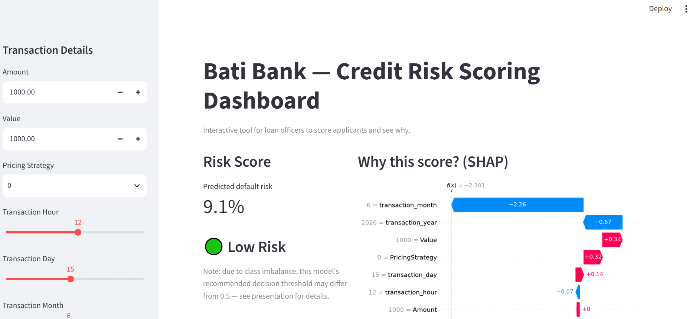
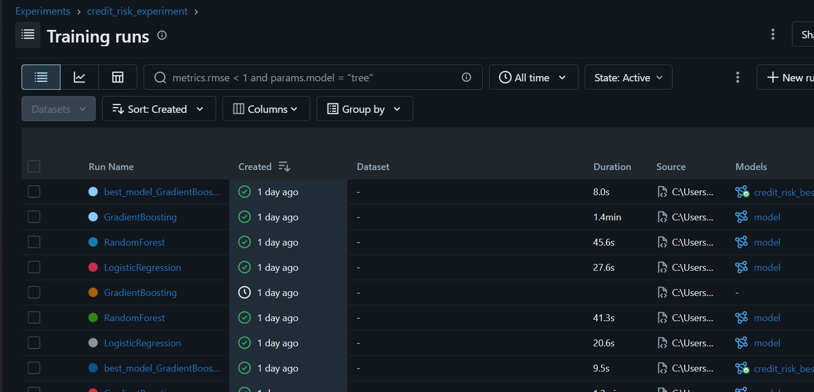
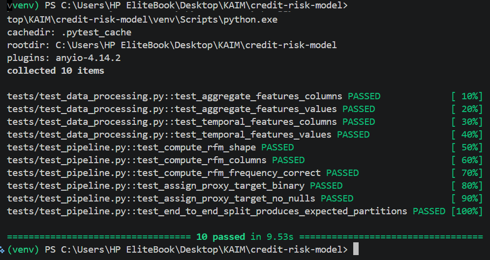

# Bati Bank Credit Risk Model


A machine learning system that scores customer creditworthiness using alternative transactional data, enabling Bati Bank to safely extend buy-now-pay-later credit to customers without traditional credit histories.

## Business Problem

Bati Bank wants to offer a "buy now, pay later" service through an eCommerce partner, but has no traditional credit bureau data on most applicants. Without a reliable risk model, the bank faces a choice between over-cautious rejection (lost revenue) and under-informed approval (default losses).

## Solution Overview

Using RFM (Recency, Frequency, Monetary) analysis on transaction histories, we construct a proxy default-risk label via a percentile-rank composite score (the bottom-engagement quartile of customers is labeled high risk). Three classifiers — Logistic Regression, Random Forest, and Gradient Boosting — are trained and compared with hyperparameter search, tracked via MLflow. The best model is served through an interactive Streamlit dashboard with SHAP-based explanations for every prediction.

## Key Results

| Metric | Logistic Regression | Random Forest | Gradient Boosting (Champion) |
|---|---|---|---|
| Accuracy | 0.734 | 0.688 | 0.726 |
| Precision | 0.049 | 0.054 | 0.059 |
| Recall | 0.594 | 0.782 | 0.757 |
| F1 Score | 0.090 | 0.100 | 0.109 |
| ROC-AUC | 0.767 | 0.809 | **0.839** |

- **Data leakage identified and corrected:** an earlier version of this pipeline leaked target-construction features (transaction count, total amount) back into the model inputs, producing an artificial 1.0 AUC. The corrected pipeline excludes these and evaluates on a genuinely unseen, customer-stratified split.
- **Class imbalance handled explicitly:** balanced class weights (Logistic Regression, Random Forest) and sample weighting (Gradient Boosting), since only ~2% of customers fall into the high-risk proxy class. This trades precision for recall — the model catches most genuinely high-risk customers at the cost of some false positives.
- **Full prediction explainability** via SHAP for every applicant, not just aggregate feature importance.

## Demo



*Loan officers can score an applicant and immediately see which features drove the prediction.*

## Quick Start

```bash
git clone https://github.com/sosena2/credit-risk-model
cd credit-risk-model
python -m venv venv
source venv/bin/activate   # or venv\Scripts\activate on Windows
pip install -r requirements.txt

python -m src.data_processing
python -m src.train
pytest tests/ -v
streamlit run dashboard/app.py
```

## Project Structure

```
├── src/
│   ├── data_processing.py    # feature engineering + proxy risk label
│   ├── train.py                # model training, MLflow tracking
│   ├── predict.py
│   ├── explain.py              # SHAP explainability
│   ├── config.py
│   └── api/
│       ├── main.py             # FastAPI serving endpoint
│       └── pydantic_models.py  # request/response schemas
├── dashboard/
│   └── app.py                  # Streamlit risk-scoring interface
├── tests/
│   ├── test_pipeline.py
│   └── test_data_processing.py
├── notebooks/
│   └── eda.ipynb
├── data/
│   ├── raw/
│   └── processed/
├── .github/workflows/ci.yml
├── Dockerfile
├── docker-compose.yml
└── requirements.txt
```

## Model Tracking

All experiments are tracked in MLflow, including hyperparameters, metrics, and the registered champion model.



## Testing

A 10-test suite covers feature engineering and proxy label construction, gated in CI on every push.



## Technical Details

- **Data:** Xente eCommerce transaction data; RFM features engineered per customer
- **Proxy target:** Since real default labels don't exist, `is_high_risk` is constructed from a percentile-rank composite of recency, frequency, and monetary value — the bottom-engagement quartile is labeled high risk
- **Model:** Best of {Logistic Regression, Random Forest, Gradient Boosting}, selected by ROC-AUC among models with non-zero F1, tracked via MLflow
- **Evaluation:** ROC-AUC, precision/recall/F1 on a held-out, customer-stratified test set (no customer's transactions appear in both train and test)
- **Explainability:** SHAP waterfall plots per prediction, surfaced live in the dashboard

## Future Improvements

- Replace the proxy label with real default outcomes once available
- Tune the decision threshold explicitly for business cost trade-offs rather than the default 0.5
- Add model monitoring for drift as new transaction patterns emerge
- A/B test the credit policy threshold against real approval outcomes

## Author

Sosina — [GitHub: sosena2](https://github.com/sosena2) — [LinkedIn] — [Email]